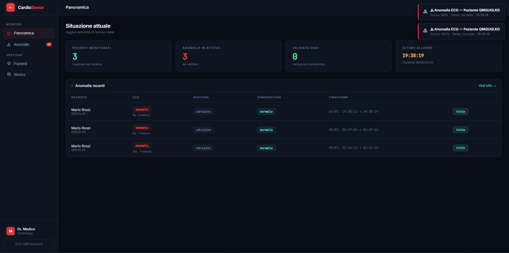

<div align="center">


# CardioSense — Presentazione (GitHub Page)

### Sistema IoT real-time per il monitoraggio closed-loop di pazienti con scompenso cardiaco

[](#)
[](#)
[](#)
[](#)

</div>

---

## Indice

- [Panoramica del progetto](#panoramica-del-progetto)
- [Architettura del sistema](#architettura-del-sistema)
- [Repository collegati](#repository-collegati)
- [Questo repository: sito di presentazione](#questo-repository-sito-di-presentazione)
- [Sviluppo locale](#sviluppo-locale)
- [Pubblicazione su GitHub Pages](#pubblicazione-su-github-pages)
- [Contesto accademico](#contesto-accademico)

---

## Panoramica del progetto

**CardioSense** è un sistema IoT end-to-end per il monitoraggio in tempo reale di pazienti affetti da **insufficienza cardiaca congestizia**. Il sistema acquisisce segnali fisiologici (ECG, postura tramite IMU a 6 assi, temperatura corporea) da un dispositivo wearable, li classifica tramite modelli di Machine Learning per rilevare anomalie cliniche, e mette in comunicazione diretta **paziente** e **medico** attraverso un'architettura event-driven basata su MQTT, con persistenza su database e validazione clinica delle anomalie rilevate.

> 🩺 **Closed-loop**: ogni anomalia rilevata automaticamente viene validata da un medico (vero positivo / falso allarme); queste validazioni rientrano nel dataset di addestramento per ri-calibrare periodicamente il classificatore ECG, chiudendo il ciclo tra IA e giudizio clinico.

---

## Architettura del sistema

> Lo schema completo — dal dongle nRF52840 al broker MQTT, ai due rami di elaborazione (classificazione + persistenza) e presentazione (dashboard) — è illustrato interattivamente nella sezione **Architettura** della pagina pubblicata da questo repository (vedi [`index.html`](index.html)).

Questo repository **non contiene codice applicativo**: è la vetrina statica dell'intero sistema, pensata per essere consultata anche da chi non ha accesso ai repository privati del progetto (es. aziende, valutatori esterni).

---

## Repository collegati

| Repository | Contenuto | Stato |
|---|---|---|
| **[CardioSense — Backend](https://github.com/UniSalento-IDALab-IoTCourse-2025-2026/wot-project-2025-2026-backend-giuri)** | Backend: classificazione ML, API REST, persistenza, broker MQTT, notifiche | Privato |
| **[cardiosense-dashboard](https://github.com/UniSalento-IDALab-IoTCourse-2025-2026/wot-project-2025-2026-dashboard-giuri)** | Dashboard medico in React (Vite) | Privato |
| **[IIT BioDataAcq](https://github.com/UniSalento-IDALab-IoTCourse-2025-2026/wot-project-2025-2026-patient-app-giuri)** | App Kivy di acquisizione + layer di integrazione MQTT | Privato |
| **[wot-project-2025-2026-presentation-giuri](.)** *(questo repo)* | Sito di presentazione (GitHub Page) | **Pubblico** |

> ℹ️ Gli altri tre repository restano privati: contengono il codice sorgente del progetto. Questo è l'unico pensato per essere pubblico, in quanto vetrina descrittiva senza dettagli implementativi sensibili.

---

## Questo repository: sito di presentazione

Sito statico **single-page** (`index.html`), HTML/CSS/JS in un unico file, senza framework né build step. Sezioni incluse:

| Sezione | Contenuto |
|---|---|
| **Hero** | Presentazione sintetica del progetto |
| **Il progetto** | Contesto clinico, obiettivi, principio closed-loop |
| **Architettura** | Diagramma SVG del sistema end-to-end |
| **Stack tecnologico** | Le tecnologie usate e perché |
| **Dimostrazione** | Video/screenshot del sistema in funzione |
| **Repository** | Link ai tre repository del progetto |

La pagina non richiede alcuna dipendenza esterna a runtime, ad eccezione dei font **IBM Plex Mono/Sans** caricati da Google Fonts via `<link>` nell'`<head>`.

### Aggiornare i contenuti multimediali

Nella sezione "Dimostrazione", i placeholder tratteggiati vanno sostituiti con gli asset reali:

```html
<!-- video: sostituire il div .video-slot con -->
<video src="assets/demo.mp4" controls poster="assets/poster.jpg"></video>

<!-- screenshot: sostituire il div .shot-slot con -->

```

Si consiglia di creare una cartella `assets/` nella root del repository per video e immagini.

---

## Sviluppo locale

Non serve alcuna installazione: essendo un singolo file HTML autocontenuto, è sufficiente aprirlo direttamente nel browser.

```bash
# oppure, per un piccolo server locale (utile per testare percorsi relativi ad assets/)
python -m http.server 8000
# poi apri http://localhost:8000
```

---

## Pubblicazione su GitHub Pages

1. Il repository deve essere **pubblico** (GitHub Pages non è disponibile su repository privati senza piano Enterprise).
2. `Settings → Pages → Source` → branch `main`, cartella `/ (root)`.
3. GitHub pubblica automaticamente l'URL:
   `https://unisalento-idalab-iotcourse-2025-2026.github.io/wot-project-2025-2026-presentation-giuri/`

> Durante lo sviluppo il repository può restare privato: GitHub Pages semplicemente non farà la build finché non viene reso pubblico. Consigliato renderlo pubblico solo a ridosso della consegna/presentazione.

---

## Contesto accademico

Sito di presentazione realizzato per l'esame di Internet of Things presso l'Università del Salento, in collaborazione con:

- **IDA Lab** - Università del Salento
- **IIT — Istituto Italiano di Tecnologia**

Per la descrizione tecnica completa del sistema, fare riferimento al README del repository **[backend](https://github.com/UniSalento-IDALab-IoTCourse-2025-2026/wot-project-2025-2026-backend-giuri)** e alla relazione di progetto consegnata per l'esame.

---

<div align="center">

Realizzato da **Francesco Giuri** — Università del Salento

</div>
